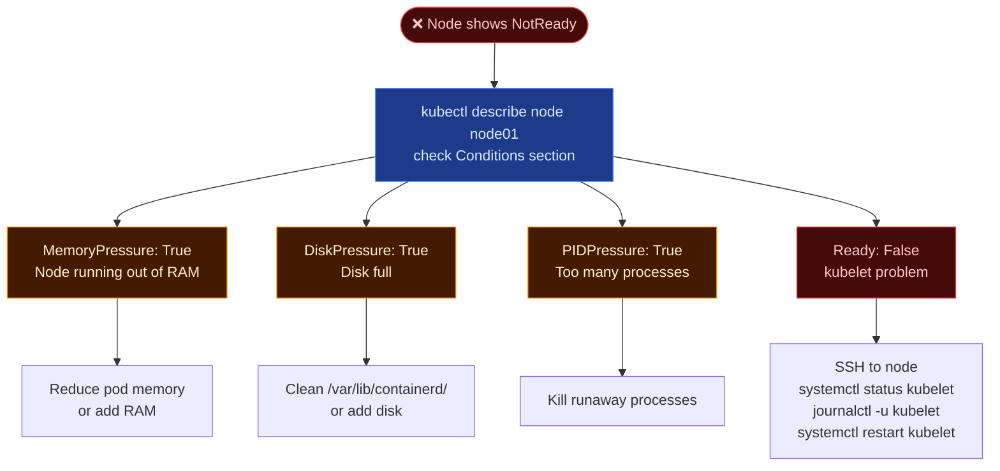

# Worker Node Failure

When a worker node fails, it typically shows up as `NotReady` in the cluster, or its pods start getting evicted. The issue usually lies with resource exhaustion (Memory/Disk/PID) or a crashed `kubelet`.

---

## 🔄 Worker Node Failure Flow



---

## 🛑 Troubleshooting Steps

| Condition | Likely Cause | Fix |
| --- | --- | --- |
| `MemoryPressure: True` | Node running out of RAM | Reduce pod memory usage or add memory |
| `DiskPressure: True` | Disk full | Clean up `/var/lib/containerd/` or add disk |
| `PIDPressure: True` | Too many processes | Check for runaway processes |
| `Ready: False` | `kubelet` problem | SSH → `systemctl status kubelet` → `journalctl -u kubelet` |
| Node stuck after fix | `kubelet` not restarted | `systemctl daemon-reload && systemctl restart kubelet` |

---

## 🛠️ CLI Quick Reference

```bash
# From control plane
kubectl get nodes
kubectl describe node node01   # look at Conditions + Events

# SSH to the worker node
ssh node01

# Check kubelet status and logs
systemctl status kubelet
journalctl -u kubelet --no-pager | tail -50

# ═══════════════════════════════
# Common kubelet issues
# ═══════════════════════════════

# 1. Wrong API server address in kubelet config
cat /etc/kubernetes/kubelet.conf | grep server

# 2. Expired certificates
openssl x509 -in /var/lib/kubelet/pki/kubelet-client-current.pem \
  -text -noout | grep 'Not After'

# 3. Disk full
df -h
du -sh /var/lib/docker/   # if using docker
du -sh /var/lib/containerd/

# 4. OOM
free -h
dmesg | grep -i oom

# Restart kubelet after fix
systemctl daemon-reload
systemctl restart kubelet
systemctl enable kubelet

# Verify from control plane
kubectl get nodes   # should show Ready
```
